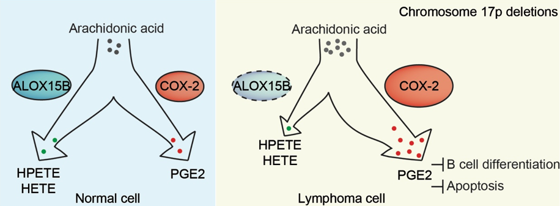

# Cyclooxygenases-Prostaglandins-in-17p-deleted-lymphoma
Cyclooxygenases/Prostaglandins contributes to chromosome 17p-deleted lymphoma biology through unbalanced arachidonate metabolism.



# Citation

Our paper has been published on XXXXX

You could downloaded raw data from [GEO Database GSE147264](https://www.ncbi.nlm.nih.gov/geo/query/acc.cgi?acc=GSE147264)


## Overview of submitted data

Our data in this paper included two part of them, mouse RNA-seq data and TCGA patients RNA-seq data. And we submitted all the scripts and some important processed files to documents respectively.

## 1. ```code for RNAseq``` documents

In ```code for RNAseq``` documents, there were tables for storing TPM, DGEs and others omics information produced in standard pipelines followed by [DESeq2 workflow](https://bioconductor.org/packages/release/workflows/vignettes/rnaseqGene/inst/doc/rnaseqGene.html). Preparation progress of case samples and normal samples information were stored in ```case-information-RNA-seq.R``` and DGE analysis and enrichment of KEGG/GO were recorded in ```analysis-workfloe-RNA-seq.R```.

## 2. `code for GSEA` documents

In ```code for GSEA``` documents,  there were code files recorded GSEA piepline followed by [Running GSEA from the Command Line](https://www.gsea-msigdb.org/gsea/doc/GSEAUserGuideTEXT.htm#_Running_GSEA_from) by comparing the expression data of shAlox25b with shRen samples. 

## 3. ```cor_in_TCGA``` documents

In ```cor_in_TCGA``` documents,  there were expression tables of TCGA-LAML and TCGA-BLBCL which were used in this paper. All the transcriptome data in TCGA database were transformed by log2(X+1). Correlations between PTGS2 expression levels and the mean expression levels of 97 genes in 17p detected in TCGA-LAML and TCGA-DLBC were calculated by Pearson's correlation coefficient and statistic powers were quantified followed by two-sided hypothesis test and 0.95 confidence level.


